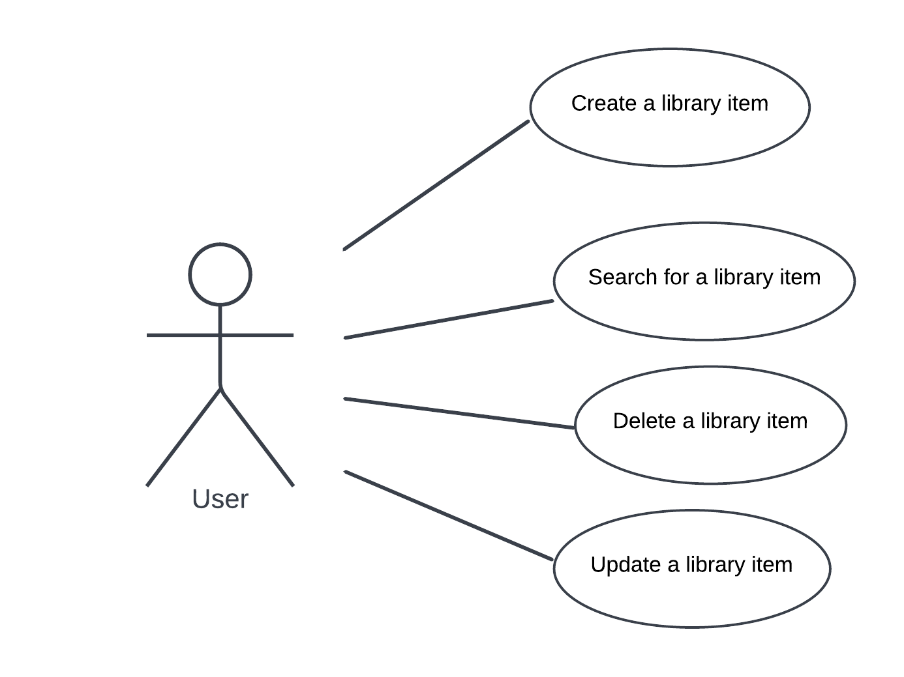

# Library Book Items CRUD Application 

This ReadMe follows the following structure:
- [Introduction](#introduction)
- [Diagrams](#diagrams)
- [Wireframes and Screen Designs](#wireframes-and-screen-designs)
- How to clone this project
- Risk assessment

# Introduction 
This is a simple C# CRUD application based on library book items which involves a frontend website (created using HTML and JS) communicating with a database using a REST API. The user is able to create, update, search and delete a library item. 

## Tools Used

- Visual Studio
- Visual Studio Code
- Git
- Azure DevOps
- Microsoft SQL Server Management Studio

## Languages Used

- C# was used to create the CRUD application in Visual Studio
- HTML, CSS, JavaScript was used to create the frontend of the project in Visual Studio Code
- TSQL 

# Diagrams

### Use Case Diagram


### Entity Relationship Diagram 

This entity relationship shows the relationship between my database.


Below I have explained why my database and the tables within it are part of a one-to-many relationship.

## Wireframes and Screen Designs
These screens were created in Adobe XD.
When designing these screens, the Fibonnacci sequence and the [Golden Ratio](https://clevelanddesign.com/insights/the-nature-of-design-the-fibonacci-sequence-and-the-golden-ratio/#:~:text=The%20Golden%20Ratio%20is%20a,subconscious%20mind%20is%20attracted%20to.) was used in order to create a visually appealing website and pleasing more enjoyable user experience,.

The icons used in these designs were taken from https://fonts.google.com/icons which is a free icon library provided by Google.

### Home and Search Screen:
This is the landing page, the first page that the user will see once they land onto my website. On this screen there is a collapsible form that was built using JavaScript, the user is able to add a new item by filling out this form. 

Once adding an item, it will appear in the list below and will also appear in the database.


### Update Screen:
The user is able to update their list of books by clicking on any item on the list. Once they have clicked on an item, a tick emoji will appear as well as a line striking through all of the text in that row.

Once updated, the number of days the item has been ```'checked out for'``` will change to 0, this will also be reflected in the database holding all of the library items. 


### Delete Screen:
To delete an item, the user should hover over the item they'd like to delete and then click on the delete icon. After clicking on the delete icon, an alert dialog will appear asking the user to confirm their deletion, once the item has been deleted it will be removed from their list of library books and will also be removed from the database. 


# Cloning this Project
Ensure you have Visual Studio Code, Visual Studio
1.	Clone the project using your preferred method (HTTPS or SSH)
2.	Open this 
3.	Once you have the above file up and running, we can open up the  which is what the user will see
4.	From here, the user will be able to interact with the website to add, delete, view and update their library book items


# Testing
TODO: Describe and show how to build your code and run the tests. 

# Risk Assessment
TODO: Explain how other users and developers can contribute to make your code better. 

If you want to learn more about creating good readme files then refer the following [guidelines](https://docs.microsoft.com/en-us/azure/devops/repos/git/create-a-readme?view=azure-devops). You can also seek inspiration from the below readme files:
- [ASP.NET Core](https://github.com/aspnet/Home)
- [Visual Studio Code](https://github.com/Microsoft/vscode)
- [Chakra Core](https://github.com/Microsoft/ChakraCore)